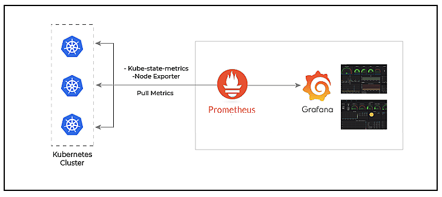
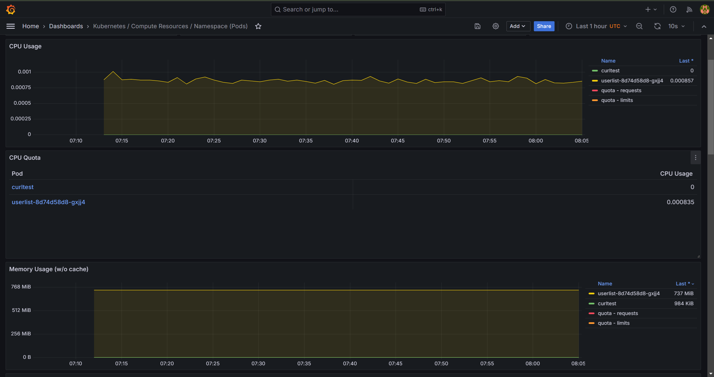
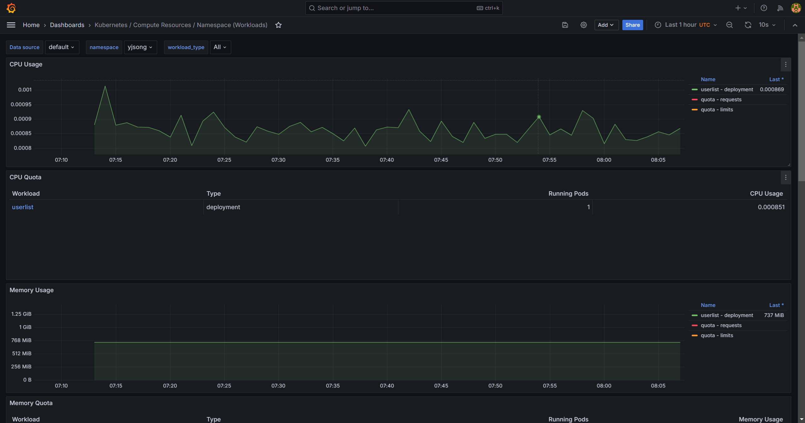
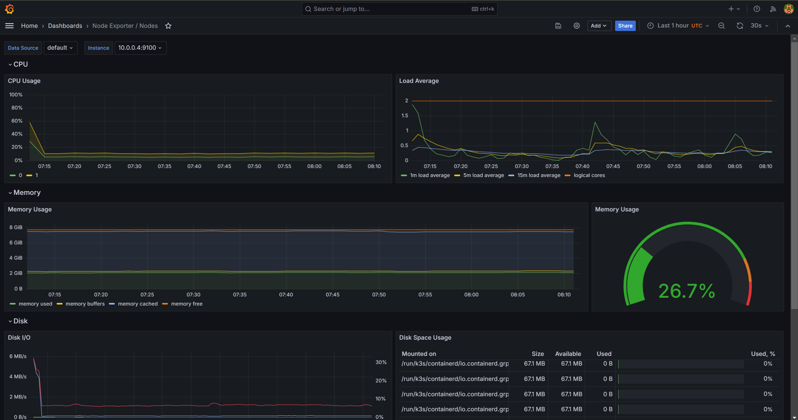

#  < K8s Monitoring Setup >


# 1. 개요

* k3s로 구성된 Kubernetes 클러스터에서 Grafana를 사용하여 모니터링을 설정하고 관리하는 방법 검토


## 1) 아키텍처




# 2. kube-prometheus-stack 설치

* `kube-prometheus-stack`은 Prometheus, Grafana, 그리고 필요한 메트릭 수집기를 포함하는 Helm 차트임

* kube-prometheus-stack Helm Chart 구성도

  * Prometheus
  * Grafana
  * 메트릭 수집기
    * kube-state-metrics
    * node-exporter

  


## 1) [참고] Helm 설치(설치되지 않은 경우)

```sh
curl https://raw.githubusercontent.com/helm/helm/master/scripts/get-helm-3 | bash
```


## 2) prometheus CRD 설치


```sh


# CRD 설치
kubectl apply --server-side -f https://raw.githubusercontent.com/prometheus-operator/prometheus-operator/main/example/prometheus-operator-crd/monitoring.coreos.com_alertmanagers.yaml
kubectl apply --server-side -f https://raw.githubusercontent.com/prometheus-operator/prometheus-operator/main/example/prometheus-operator-crd/monitoring.coreos.com_podmonitors.yaml
kubectl apply --server-side -f https://raw.githubusercontent.com/prometheus-operator/prometheus-operator/main/example/prometheus-operator-crd/monitoring.coreos.com_probes.yaml
kubectl apply --server-side -f https://raw.githubusercontent.com/prometheus-operator/prometheus-operator/main/example/prometheus-operator-crd/monitoring.coreos.com_prometheuses.yaml
kubectl apply --server-side -f https://raw.githubusercontent.com/prometheus-operator/prometheus-operator/main/example/prometheus-operator-crd/monitoring.coreos.com_prometheusrules.yaml
kubectl apply --server-side -f https://raw.githubusercontent.com/prometheus-operator/prometheus-operator/main/example/prometheus-operator-crd/monitoring.coreos.com_servicemonitors.yaml
kubectl apply --server-side -f https://raw.githubusercontent.com/prometheus-operator/prometheus-operator/main/example/prometheus-operator-crd/monitoring.coreos.com_thanosrulers.yaml


customresourcedefinition.apiextensions.k8s.io/alertmanagers.monitoring.coreos.com serverside-applied
customresourcedefinition.apiextensions.k8s.io/podmonitors.monitoring.coreos.com serverside-applied
customresourcedefinition.apiextensions.k8s.io/probes.monitoring.coreos.com serverside-applied
customresourcedefinition.apiextensions.k8s.io/prometheuses.monitoring.coreos.com serverside-applied
customresourcedefinition.apiextensions.k8s.io/prometheusrules.monitoring.coreos.com serverside-applied
customresourcedefinition.apiextensions.k8s.io/servicemonitors.monitoring.coreos.com serverside-applied
customresourcedefinition.apiextensions.k8s.io/thanosrulers.monitoring.coreos.com serverside-applied


## 확인
$ kubectl get crds | grep monitoring.coreos.com
alertmanagers.monitoring.coreos.com        2024-06-07T07:06:26Z
podmonitors.monitoring.coreos.com          2024-06-07T07:06:40Z
probes.monitoring.coreos.com               2024-06-07T07:06:40Z
prometheuses.monitoring.coreos.com         2024-06-07T07:06:41Z
prometheusrules.monitoring.coreos.com      2024-06-07T07:06:42Z
servicemonitors.monitoring.coreos.com      2024-06-07T07:06:42Z
thanosrulers.monitoring.coreos.com         2024-06-07T07:06:43Z

```


## 2) Helm 저장소 추가 및 업데이트

```sh
$ 
helm repo add prometheus-community https://prometheus-community.github.io/helm-charts
helm repo add grafana https://grafana.github.io/helm-charts
helm repo update
```


## 3) Helm values.yaml 확인

```sh
$ helm search repo kube-prometheus-stack
NAME                                            CHART VERSION   APP VERSION     DESCRIPTION
prometheus-community/kube-prometheus-stack      60.0.0          v0.74.0         kube-prometheus-stack collects Kubernetes manif...


# values 확인
$ helm show values prometheus-community/kube-prometheus-stack


$ mkdir -p ~/helm/charts
  cd ~/helm/charts


# chart download (fetch)
$ helm fetch prometheus-community/kube-prometheus-stack

$ ll 
-rw-r--r-- 1 song song 514087 Jun  7 06:46 kube-prometheus-stack-60.0.0.tgz

$ tar -xzvf kube-prometheus-stack-60.0.0.tgz

$ cd ~/helm/charts/kube-prometheus-stack

# values.yaml 확인
$ vi values.yaml


```


## 4) kube-prometheus-stack 설치

```sh
# NS 생성
$ kubectl create ns monitoring


$ helm -n monitoring install prometheus prometheus-community/kube-prometheus-stack \
  --set alertmanager.enabled=false \
  --set grafana.ingress.enabled=true \
  --set grafana.ingress.hosts[0]=grafana.songedu.duckdns.org \
  --set prometheus.ingress.enabled=true \
  --set prometheus.ingress.hosts[0]=prometheus.songedu.duckdns.org \
  --dry-run=true  > 11.dry-run.yaml
  
############
NAME: prometheus
LAST DEPLOYED: Fri Jun  7 07:10:51 2024
NAMESPACE: monitoring
STATUS: deployed
REVISION: 1
NOTES:
kube-prometheus-stack has been installed. Check its status by running:
  kubectl --namespace monitoring get pods -l "release=prometheus"


# 확인
$ helm -n monitoring ls
NAME            NAMESPACE       REVISION        UPDATED                                 STATUS          CHART                           APP VERSION
prometheus      monitoring      1               2024-06-07 07:10:51.800079245 +0000 UTC deployed        kube-prometheus-stack-60.0.0    v0.74.0

```


# 3. UI 접속

Helm 차트를 통해 Grafana가 설치되었으므로, 이를 구성하고 접근하는 방법을 설정해야 합니다.


## 1) **Grafana UI 접속**

domain 확인

```sh
# Grafana domain 확인
$ kubectl get ingress -n monitoring
NAME                                    CLASS     HOSTS                            ADDRESS                      PORTS   AGE
prometheus-grafana                      traefik   grafana.songedu.duckdns.org      10.0.0.4,10.0.0.5,10.0.0.6   80      2m2s


# Grafana password 확인
$ kubectl get secret -n monitoring prometheus-grafana -o jsonpath="{.data.admin-password}" | base64 --decode ; echo
prom-operator


# ID / PASS
# admin / prom-operator

```


## 2) **Prometheus UI 접속**

domain 확인

```sh
$ kubectl get ingress -n monitoring
NAME                                    CLASS     HOSTS                            ADDRESS                      PORTS   AGE
prometheus-kube-prometheus-prometheus   traefik   prometheus.songedu.duckdns.org   10.0.0.4,10.0.0.5,10.0.0.6   80      2m2s

```


# 4. Prometheus 


## 1) 접속URL

```
http://prometheus.songedu.duckdns.org

```


## 2) Target

* Prometheus가 모니터링하고 있는 모든 엔드포인트를 표기함
* Prometheus는 `prometheus.yml` 파일의 `scrape_configs` 섹션에서 설정된 대상들을 스크랩함

* 메뉴
  * Status > Target
* Targets의 주요 기능
  - **모니터링 상태 확인**
    - Prometheus가 대상의 메트릭을 정상적으로 수집하고 있는지 확인
    - 특정 대상이 `UP` 상태인지, `DOWN` 상태인지, 스크랩에 실패한 이유는 무엇인지 등을 파악
  - **문제 해결**
    - 어떤 대상에서 문제가 발생했는지, 스크랩에 실패한 이유는 무엇인지 확인
  - **라벨 및 메트릭 필터링**
    - 각 대상에 적용된 라벨을 통해 메트릭을 필터링하고 구체적인 데이터를 분석

## 3) Graph

* Prometheus에서 저장된 매트릭 데이터를 시각화 하여 보여준다.
* PromQL 을 직접 쿼리하여 결과를 확인할 수 있다.


### PromQL 예제

```sh
# 단순메트릭 조회
up

# 특정 매티릭 필터링
up{job="node-exporter"}
up{job="node-exporter", instance="10.0.0.5:9100"}


# node_memory_MemFree 예제
node_memory_MemFree_bytes

# 필터링
node_memory_MemFree_bytes{instance="10.0.0.5:9100"}

# 5동안의 Rate를 계산하여 보여준다.
rate(node_memory_MemFree_bytes{instance="10.0.0.5:9100"}[5m])

```


# 5. Grafana


## 1) 접속URL

```
http://grafana.songedu.duckdns.org

```


## 2) CoreDNS

* 메뉴 : Home > Dashboards > 
* CoreDNSCoreDNS는 Kubernetes의 기본 DNS 서버로, 클러스터 내 서비스 디스커버리 및 DNS 이름 해석을 담당
* 클러스터의 안정성과 네트워크 성능을 확인하기 위해 CoreDNS의 성능과 상태를 모니터링 수행


## 3) Namespace (Pods)

* 메뉴 : Home > Dashboards > Kubernetes / Compute Resources / Namespace (Pods)
* POD 별 리소스(CPU/Memory)의 사용량을 확인 가능
* 특정 POD 를 클릭하면 POD 만 볼수 있는 별도의 모니터링 화면으로 이동됨




## 4) Namespace (Workloads)

* 메뉴 : Home > Dashboards > Kubernetes / Compute Resources / Namespace (Pods)
* Workloads 별 리소스(CPU/Memory)의 사용량을 확인 가능
* 개별 POD가 아닌 POD 를 배포하는 Workload 단위로 리소스를 확인 함



 


## 5) Nodes

* 메뉴 : Home > Dashboards > Node Exporter / Nodes
* Node별 CPU, Memory, Disk 사용량을 확인한다.



* 실제 운영 환경에서도 POD 들이 과도하게 Scheduling 될때가 자주 발생함.
* 이때 Node상태를 확인하는 중요한 모니터링이 된다.


